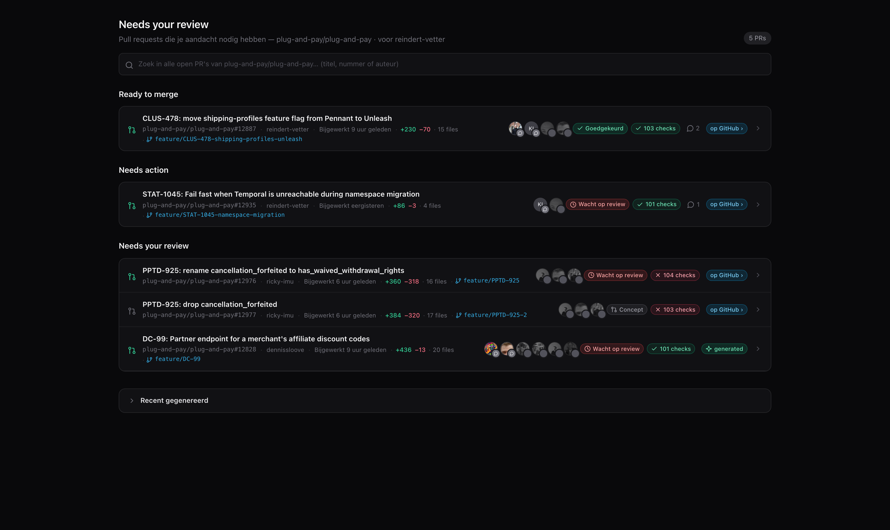
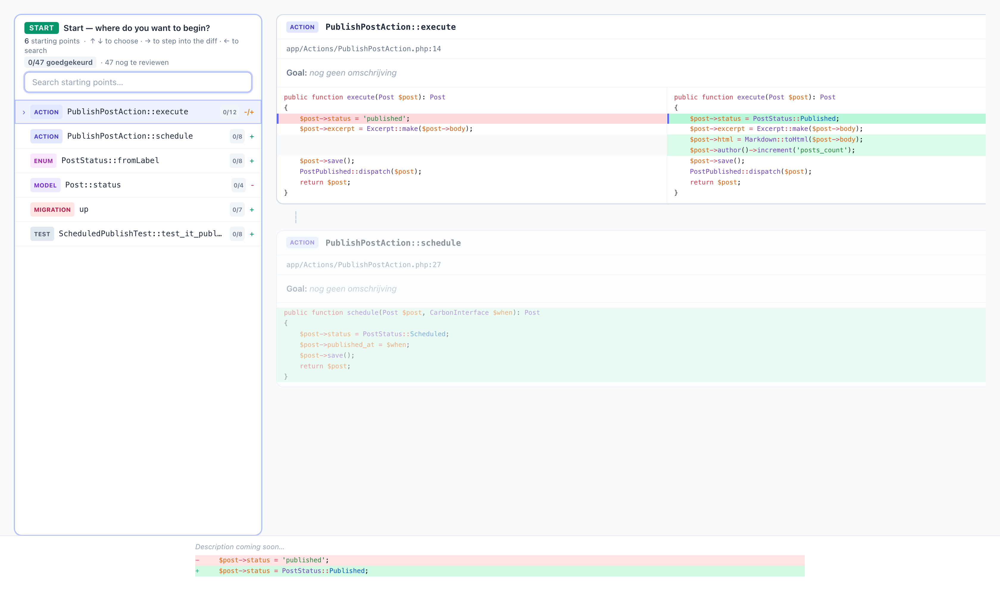
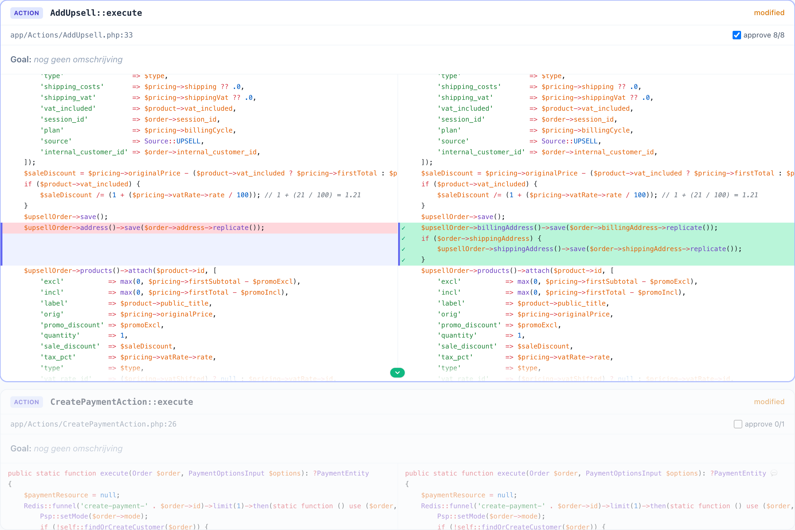
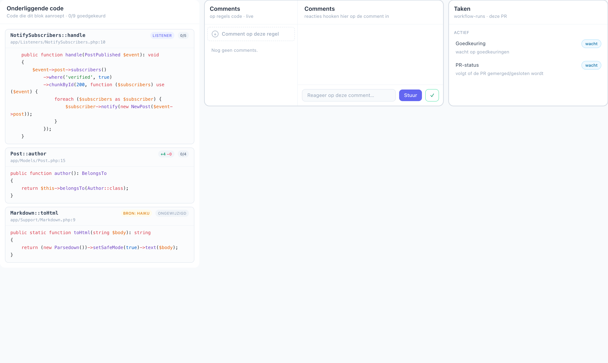

# PR Review Tree (`slash`)

Turn a GitHub pull request into a **function-call tree** you review in the browser.
Instead of scrolling one giant "Files changed" diff, `slash` breaks the PR into
**blocks** (one PHP function/method each), lays them out as a navigable list, and
links each block to the code it calls — so you can see *what* a change touches and
*how* the pieces call one another while you review.

It targets `plug-and-pay/plug-and-pay` today, but the pipeline is generic: give it
a PR number and it builds the tree.

## Screenshots

**PR inbox** — a live GitHub dashboard of the PRs that need your attention, rebuilt
in the shape of GitHub's own `/pulls` page (sections, review state, CI checks,
reviewers, diff-stats). Fully read-only.



**Review page** — the block index on the left ("Start — where do you want to
begin?") with per-block category and approval progress, and the selected block's
side-by-side diff on the right.



**Block diff** — stepping through a single block. The active change group is
highlighted, changed lines are red/green, and granular approval (`approve 0/3`)
lives right on the card.



**Underlying code** — the "Onderliggende code" card resolves the method calls a
block makes to their definitions (statically in Go, with an LLM fallback — note the
`BRON: HAIKU` badge and the `Ongewijzigd` badge for calls into unchanged files),
next to the comment thread and the per-PR task list.



## What it does

- **PR → blocks.** Fetches the PR, sets up base/head worktrees, parses the changed
  PHP into functions/methods, and classifies each as added / modified / removed.
- **Side-by-side diff per block**, aligned line-by-line with a pure-JS LCS diff
  (whitespace-insensitive, char-level highlighting) — no AI for the diff itself.
- **Keyboard-first navigation** with three zoom levels — group → line → **call**
  (a single call segment inside a line), so every call becomes an edge in the graph.
- **Underlying code.** Each block links to the definitions it calls, even in files
  the PR doesn't touch. A Go resolver handles the common cases (`$this->`, `Foo::m`,
  Eloquent relations, enum cases, macros, facades, scheduled commands); anything it
  can't pin is escalated to an LLM (Haiku, then Sonnet) automatically.
- **Granular approval.** Approve a whole block, a group, a line, or a single call
  segment. The tree rolls the counts up so you can see how much of a call subtree is
  reviewed.
- **Comments & tasks** on a line of code, posted to GitHub and kept alive as a
  thread.
- **PR inbox** — a read-only GitHub dashboard as the landing page.

## Stack & design philosophy

**The stack is deliberately minimal and has no build step.** That's a hard design
choice, not an accident: nothing here needs a bundler, transpiler, or compile
pass. When in doubt, pick the smaller, more boring option.

- **Go, no framework.** A small standard-library HTTP server (`net/http`) that
  serves the repo statically plus a thin `/api/*` bridge to local CLIs (`gh` for
  GitHub, `claude` for consults). Production dependencies are Go built-ins only —
  the single approved runtime dependency is `modernc.org/sqlite`, the pure-Go
  SQLite driver (no cgo, so still no build step).
- **Vanilla JS ES modules** (`.mjs`) in `src/`, reactive via
  [arrow.js](https://www.arrow-js.com/) (vendored). No React/Vue/bundler.
- **Tailwind via the Play CDN** (in-browser) and **Prism** vendored for syntax
  highlighting.
- **SQLite** for the call-graph and read-models.
- **[tembed](https://github.com/reindert-vetter/tembed)** — an embeddable durable
  workflow engine ("Temporal, but a Go package"), vendored as a git subtree. Every
  state change flows through a workflow; everything else is read-only.

## Getting started

Requires **Go 1.25+**. The `gh` CLI (authenticated) is needed to ingest real PRs;
`claude` is optional (used for the LLM call-resolution fallback).

```sh
# Run the server (defaults to http://127.0.0.1:8765)
go run .

# Ingest a PR into blocks (headless)
go run . ingest 12903

# ...or POST to the running server
curl -X POST http://localhost:8765/api/ingest -d '{"pr":12903}'
```

Then open <http://localhost:8765/pr-overview> for the inbox, or
<http://localhost:8765/pr/12903> for a specific PR.

**Flags & env:**

- `-db <path>` / `SLASH_DB` — SQLite DB path (default `data/graph.db`).
- `-addr host:port` — listen address (default `127.0.0.1:8765`).
- `SLASH_REPO_DIR` — local clone of the target repo used for git/worktree
  operations (default `~/dev/plug-and-pay`; a leading `~` is expanded to your
  home dir).
- `SLASH_GITHUB=off` — serve inbox data from a fixture instead of hitting GitHub.
- `SLASH_CLAUDE=off` — disable the LLM call-resolution fallback.

Other subcommands: `go run . relations <pr>` (rebuild the relation / call-resolve
read-models) and `go run . seed …` (seed read-models for tests).

## How it works

The **ingest pipeline** is: `gh pr view` → `git fetch` → two detached worktrees
under `data/worktrees/pr-<n>-{base,head}` → `git diff` → a brace-lexer PHP scanner
(no external parser) → classify → store in SQLite.

The **write boundary** is a hard rule: workflows are the only writers. State changes
only through a tembed Workflow Execution (starting one, or sending it a signal);
every other endpoint and the whole UI are read-only. The workflow event-history is
the source of truth, and each module table (comments, approvals, relations, …) is a
derived read-model an Activity keeps up to date.

Navigation position lives in the URL query string, so a refresh or a shared link
reopens the exact same spot.

The deeper architecture docs live under [`.claude/rules/`](.claude/rules/) and in
[`CLAUDE.md`](CLAUDE.md) (in Dutch — this README is the outward-facing summary).

## Testing

- **Go:** `go test ./...` — the server, ingest, resolver, and workflow tests.
- **End-to-end:** `npx playwright test` — the only real npm dependency
  (`@playwright/test`), used for tests, never in production.

## Repo layout

| Path | What |
|---|---|
| `*.go` (root) | HTTP server, ingest pipeline, PHP scanner, workflows, `/api/*` bridge |
| `modules/` | Read-models & side-effect services driven by workflow Activities (`comments`, `github`, `relations`, `callresolve`, `approvals`, …) |
| `tembed/` | The durable workflow engine (git subtree; its own module) |
| `src/` | Frontend ES modules — `home.mjs`, `Block.mjs`, `RelatedPanel.mjs`, `overview.mjs`, … |
| `src/vendor/` | Vendored arrow.js and Prism |
| `index.html` / `overview.html` | The two static page shells (review page, PR inbox) |
| `data/` | SQLite DBs and the base/head worktrees (gitignored) |
| `.claude/` | Architecture rules, skills, templates (Dutch) |
| `tests/` | Playwright specs and fixtures |
